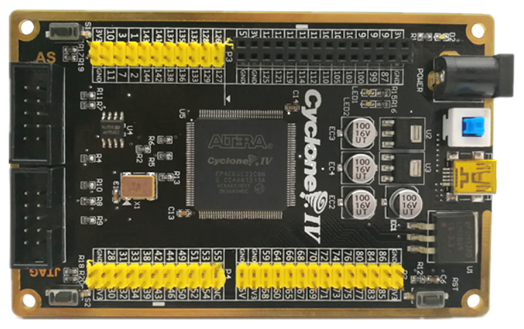
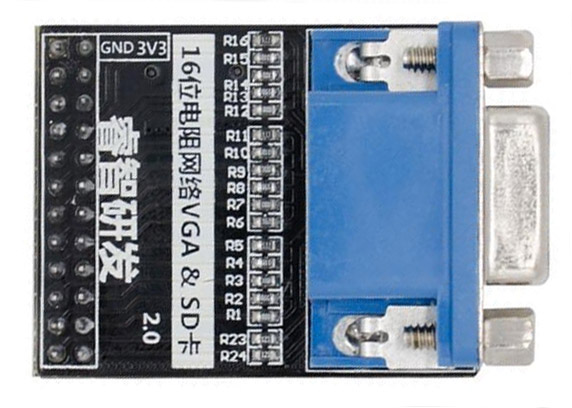

# EP4CE6E22C8N FPGA Core Board from AliExpress
These are a collection of notes and resources, inasmuch for myself as for anyone else who might need it. They are a combination of what the seller has sent to me (i.e., schematics) and information I have gleamed from probing the board myself while referring to the schematics. If you find any errors, please let me know, or fork and make a pull request. NO WARRANTY IS PROVIDED, either expressed or implied. As always, the best is to double check yourself before you do something irreversible.

**NB!!! Make sure you ONLY POWER THE BOARD WITH 5V DC at the DC barrel jack, or with a USB cable**

## Port Descriptions
This is as close as I can figure them out to be.

| Port Name/Label | Usage |
| --------------- | ----- |
| Power | Provide DC 5V 1A power to the board |
| Blue switch | Turns DC barrel jack power on/off |
| USB Type B Mini | Power the board with USB. No data |
| P1 header | For camera module |
| P2 header | For VGA/SD Card/PS2/Ethernet module(s) |
| P3 header | For SDRAM module |
| P4 header | For SDRAM module |
| AS IDC port | "Active Serial" - To directly program the SPI config memory |
| JTAG IDC port | For JTAG programming |

## Pin Assignments
Only the unlabelled pin assignments will be indicated here - as for the pin headers themselves, the package pin numbers are already printed next to the pins themselves
so I would direct you to either the schematic or the board silkscreen itself for reference.

| Signal Name | Pin Number | Notes |
| ----------- |:----------:| ----- |
| LED1        | 98         | Logic 0 to turn on. |
| LED2        | 87         | Logic 0 to turn on. |
| S1          | 24         | Pull-Up resistor |
| S2          | 25         | Pull-Up resistor |
| CLOCK (X1)  | 23         | 50 MHz |
| RESET       | 88         | Active low |

## VGA and Micro SD-Card Module
The VGA and Micro SD-Card Module is meant to be plugged into header P2, being sure to align the GND and 3V3 (3.3V) pins which are marked on the module itself.

| FPGA Pin | Function |     |     | Function | FPGA Pin |
|:--------:| -------- | --- | --- | -------- |:--------:|
|     | GND   | 1    | 2    | 3V3    |     |
| 86  | MOSI  | 3    | 4    | CS     | 85  |
| 84  | MISO  | 5    | 6    | SCK    | 83  |
| 80  | Red   | 7    | 8    | Red    | 77  |
| 76  | Red   | 9    | 10   | Red    | 75  |
| 74  | Red   | 11   | 12   | Green  | 73  |
| 72  | Green | 13   | 14   | Green  | 71  |
| 70  | Green | 15   | 16   | Green  | 69  |
| 68  | Green | 17   | 18   | Blue   | 67  |
| 66  | Blue  | 19   | 20   | Blue   | 65  |
| 64  | Blue  | 21   | 22   | Blue   | 60  |
| 59  | VSYNC | 23   | 24   | HSYNC  | 58  |
